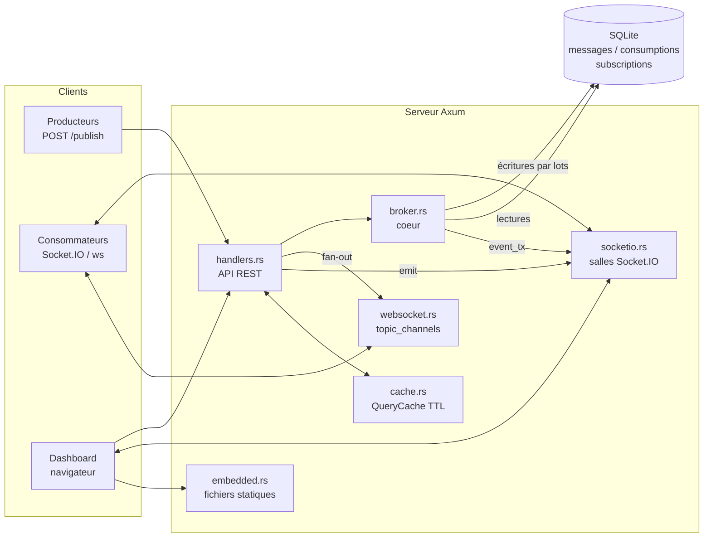
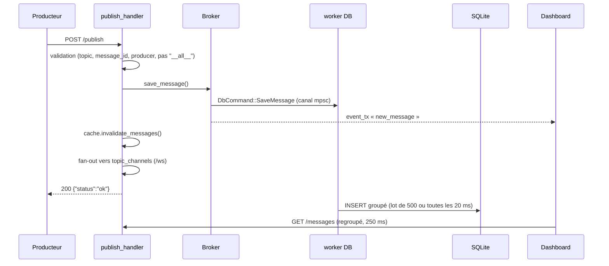

# Claude.md — Rust-PubSub-Server

## Préférences de travail

Réponses concises, sans verbiage. Code efficace avant tout.
Commentaires et documentation **en français, avec les accents**.
Les schémas se font en **Mermaid** — jamais de diagrammes ASCII.

## Ce qu'est ce dépôt

Broker pub/sub en Rust (Axum + socketioxide + SQLite via SQLx) doublé d'un dashboard
temps réel servi en fichiers statiques embarqués (`rust-embed`).

- API REST : `/publish`, `/clients`, `/messages`, `/consumptions`, `/graph/state`, `/health`
- Temps réel : Socket.IO sur `/` et WebSocket brut sur `/ws`
- Dashboard : `login.html`, `control-panel.html`, `activity-map.html`, `circular-graph.html`
- Écoute sur `0.0.0.0:5000` ; base définie par `DATABASE_FILE` (défaut : mémoire partagée)

Aucune dépendance réseau à l'exécution : Bootstrap, Socket.IO et D3 sont embarqués dans le
binaire sous `static/vendor/` (voir `static/vendor/README.md`).

## Architecture



### Chemin d'une publication



## Invariants à ne pas casser

- **Aucune donnée du broker n'entre dans le DOM via `innerHTML`.** Topics, producteurs,
  consommateurs et charges utiles sont choisis par quiconque peut publier. Le rendu passe
  par `DashboardUtils.renderRows`, qui écrit en `textContent`.
- **`__all__` est une salle réservée** (abonnements wildcard). `publish_handler` refuse ce
  nom de topic.
- **La table `consumptions` n'a pas de colonne `id`** — utiliser `rowid`. Une purge écrite
  avec `id` échoue et annule toute la transaction.
- **Les PRAGMA par connexion** (`busy_timeout`, `cache_size`, `temp_store`, `mmap_size`,
  `synchronous`) doivent être déclarés dans `SqliteConnectOptions`, pas exécutés une fois
  sur le pool : sinon une seule connexion sur dix les reçoit.
- **Base en mémoire** : passer par une base *nommée* en cache partagé et garder
  `min_connections(1)`, sinon chaque connexion du pool ouvre sa propre base vide.
- **Une seule feature d'émission** à la fois (`parallel-emit` *ou* `sequential-emit`) —
  un `compile_error!` le garantit.
- **Les caches sont invalidés à l'écriture**, pas seulement par TTL : le dashboard recharge
  immédiatement après l'événement et servirait autrement un instantané antérieur.
- **`table` du dashboard = source serveur.** Le socket « moniteur » et le socket
  « consommateur de test » sont deux connexions distinctes (`forceNew`) ; ne pas les fusionner,
  `io()` renvoie sinon le socket en cache et empile les gestionnaires.

## Commandes

```bash
cargo build                 # feature parallel-emit par défaut
cargo clippy --all-targets
cargo fmt
DATABASE_FILE=pubsub.db cargo run
make help                   # cibles Docker / perf
```

Les fichiers statiques sont embarqués à la compilation : toute modification de `static/`
ou des `*.html` exige une recompilation pour être servie.

## Pièges connus (revue d'août 2026)

- `CorsLayer::permissive()` + absence d'authentification : `/publish` et `/dashboard/login`
  sont ouverts à n'importe quelle origine. `dashboard_enabled` est un drapeau **global au
  processus**, pas une session par utilisateur — une déconnexion coupe le flux pour tous.
- La purge conserve `MAX_MESSAGES` / `MAX_CONSUMPTIONS` lignes et 24 h de données, toutes les
  30 minutes ; la table `subscriptions` est vidée au démarrage (les lignes survivant à un arrêt
  brutal sont périmées par définition).
